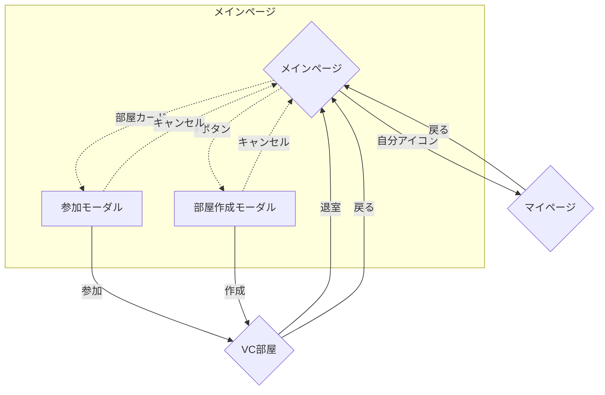

# ページ遷移図

```mermaid
flowchart TB
  main{メインページ}
  mypage{マイページ}
  room{VC部屋}
  enter[参加モーダル]
  create_room[部屋作成モーダル]
  
  main -- 自分アイコン --> mypage

  subgraph メインページ
  main -. 部屋カード .-> enter
  main -. +ボタン .-> create_room
  end

  enter -- 参加 --> room
  enter -. キャンセル .-> main

  create_room -- 作成 --> room
  create_room -. キャンセル .-> main

  room -- 退室 --> main
  room -- 戻る --> main

  mypage -- 戻る --> main

```

 

### メインページ
* 部屋一覧が見れる

### ユーザーページ
* 悩み
  * マイページだけ？　他人も見れる？

### VC部屋
* チャット機能
